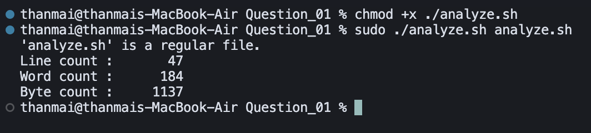

## Question 1 – File / Directory Analyzer

- **Script**: `analyze.sh`
- **Purpose**: Analyze a given path and print file statistics if it is a regular file, or file counts if it is a directory.

### How to Run

Make the script executable (one-time):

```bash
chmod +x analyze.sh
```

Run the script with exactly one argument (file or directory path). Example using the provided sample data:

```bash
./analyze.sh sample.txt
./analyze.sh sample_dir
```

### Logic / Observation

The script first validates that exactly one argument is provided and that the path exists.  
If it is a regular file, it uses `wc` to report line, word, and byte counts; if it is a directory, it uses `find` to count all regular files and how many of them are `.txt` files.

### Screenshot



### Output

```bash
chmod +x ./analyze.sh
sudo ./analyze.sh analyze.sh
```

```
'analyze.sh' is a regular file.
Line count : 47
Word count : 184
Byte count : 1137
```

### Explanation

The first command (`chmod +x`) makes `analyze.sh` executable. The second command runs the script with `analyze.sh` itself as the argument. The script correctly identifies the path as a regular file and uses `wc` to report **line count** (47 lines), **word count** (184 words), and **byte count** (1137 bytes). This confirms the file analyzer works as intended when given a regular file.

### Simulated Terminal Output (other examples)

Example run on the provided `sample.txt`:

```bash
$ cd Question_01
$ chmod +x analyze.sh
$ ./analyze.sh sample.txt
'sample.txt' is a regular file.
Line count : 3
Word count : 10
Byte count : 86
```

Example run on the provided `sample_dir`:

```bash
$ ./analyze.sh sample_dir
'sample_dir' is a directory.
Total files      : 2
Text (*.txt) files: 1
```

