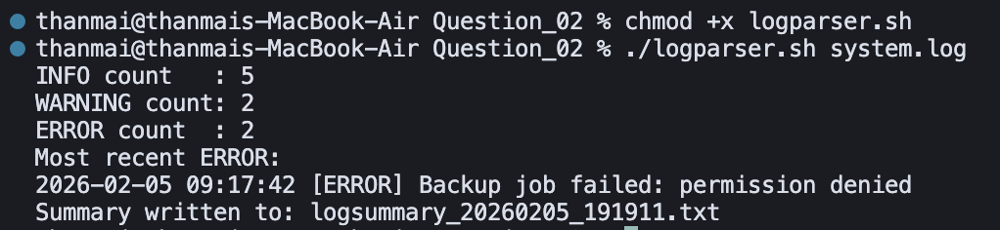

## Question 2 – Log Parser

- **Script**: `logparser.sh`
- **Purpose**: Parse a log file, count `INFO`, `WARNING`, and `ERROR` entries, display the most recent `ERROR`, and write a timestamped summary file.

### How to Run


```bash
chmod +x logparser.sh
```


```bash
./logparser.sh system.log
```

### Logic / Observation

The script validates that the log file exists and is readable, then uses `grep` to count lines containing `INFO`, `WARNING`, and `ERROR`.  
It extracts the most recent `ERROR` line using `tail -n 1` and writes all statistics plus that last error into a `logsummary_<date>.txt` file while echoing the same key information to the terminal.

### Screenshot



### Output

```bash
chmod +x logparser.sh
./logparser.sh system.log
```

```
INFO count : 5
WARNING count: 2
ERROR count : 2
Most recent ERROR:
2026-02-05 09:17:42 [ERROR] Backup job failed: permission denied
Summary written to: logsummary_20260205_191911.txt
```

### Explanation

After making the script executable, `logparser.sh` is run with `system.log` as the input. The script counts log levels (**INFO: 5**, **WARNING: 2**, **ERROR: 2**), prints the **most recent ERROR** line (backup job failed due to permission denied), and writes a timestamped summary file (`logsummary_20260205_191911.txt`). This shows the log parser correctly aggregates levels and highlights the latest error for quick diagnosis.


