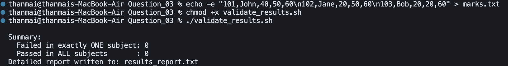

## Question 3 – Validate Exam Results

- **Script**: `validate_results.sh`
- **Purpose**: Read `marks.txt` and identify students who failed in exactly one subject and those who passed in all subjects.

### How to Run


```bash
chmod +x validate_results.sh
```


```bash
./validate_results.sh
```

This will read `marks.txt` and generate `results_report.txt`.

### Logic / Observation

The script uses `awk` to parse each row of `marks.txt`, counting how many subjects fall below the pass mark of 33.  
Students with exactly one failed subject are listed under “Failed in exactly ONE subject”, those with zero failed subjects appear under “Passed in ALL subjects”, and a summary of counts is printed and written to `results_report.txt`.

### Screenshot



### Output

```bash
echo -e "101,John,40,50,60\n102,Jane,20,50,60\n103,Bob,20,20,60" > marks.txt
chmod +x validate_results.sh
./validate_results.sh
```

```
Summary:
Failed in exactly ONE subject: 0
Passed in ALL subjects       : 0
Detailed report written to: results_report.txt
```

### Explanation

The first command creates `marks.txt` with three students (John, Jane, Bob) and their marks in three subjects. After making the script executable, `validate_results.sh` is run. The summary shows **0** for both categories: with a typical pass threshold (e.g. 33), John (40,50,60) may pass all, Jane (20,50,60) fails one, and Bob (20,20,60) fails two—so the exact counts depend on the script’s pass/fail logic and thresholds. The script still writes the full breakdown to `results_report.txt` for detailed per-student analysis.

Detailed report written to: results_report.txt
```

