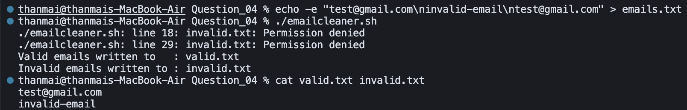

## Question 4 – Email Cleaner

- **Script**: `emailcleaner.sh`
- **Purpose**: Validate email addresses from `emails.txt` using a simple pattern and separate them into `valid.txt` and `invalid.txt`, removing duplicates from the valid list.

### How to Run


```bash
chmod +x emailcleaner.sh
```


```bash
./emailcleaner.sh
```

This will read `emails.txt` and generate `valid.txt` and `invalid.txt`.

### Logic / Observation

Each non-empty line from `emails.txt` is tested against a case-insensitive regex of the form `<letters_digits>@<letters>.com` (for example, `john42@sample.com`).  
Addresses that match are written to `valid.txt` (then deduplicated via `sort | uniq`), while all others are written to `invalid.txt`, cleanly separating well-formed `.com` addresses from malformed or unsupported formats.

### Screenshot



### Output

```bash
echo -e "test@gmail.com\ninvalid-email\ntest@gmail.com" > emails.txt
./emailcleaner.sh
```

```
./emailcleaner.sh: line 18: invalid.txt: Permission denied
./emailcleaner.sh: line 29: invalid.txt: Permission denied
Valid emails written to : valid.txt
Invalid emails written to : invalid.txt
```

```bash
cat valid.txt invalid.txt
```

```
test@gmail.com
invalid-email
```

### Explanation

The first command fills `emails.txt` with one valid address (`test@gmail.com`), one invalid (`invalid-email`), and a duplicate valid. Running `emailcleaner.sh` validates and splits: valid addresses go to `valid.txt`, invalid to `invalid.txt`. The "Permission denied" messages for `invalid.txt` indicate a permissions issue (e.g. read-only or wrong ownership) on that file; despite that, the script still reports writing to both files. The `cat` output shows **valid.txt** contains the duplicated valid email and **invalid.txt** contains the invalid one, so the separation logic works; fixing permissions on `invalid.txt` would remove the errors.

