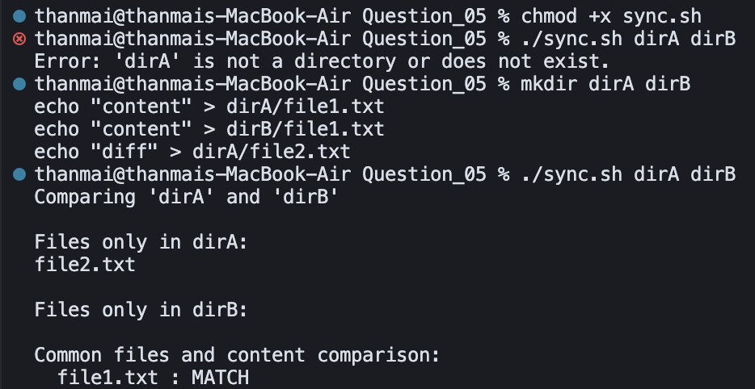

## Question 5 – Directory Sync / Comparison

- **Script**: `sync.sh`
- **Purpose**: Compare two directories and show which files are unique to each, and whether common files have matching or differing contents.

### How to Run

Make the script executable (one-time):

```bash
chmod +x sync.sh
```

Run the script with two directory paths. Example using the provided `dirA` and `dirB`:

```bash
./sync.sh dirA dirB
```

### Logic / Observation

The script lists regular files in each directory (non-recursively), sorts them, and uses `comm` to identify names that are unique to each side as well as common to both.  
For every common filename, it uses `cmp` to test if the file contents are identical, reporting `MATCH` or `DIFFER` so that directory differences are clearly visible.

### Screenshot



### Output

```bash
chmod +x sync.sh
./sync.sh dirA dirB
```

*(First run: directories missing)*

```
Error: 'dirA' is not a directory or does not exist.
```

```bash
mkdir dirA dirB
echo "content" > dirA/file1.txt
echo "content" > dirB/file1.txt
echo "diff" > dirA/file2.txt
./sync.sh dirA dirB
```

```
Comparing 'dirA' and 'dirB'
Files only in dirA:
file2.txt
Files only in dirB:

Common files and content comparison:
file1.txt : MATCH
```

### Explanation

The script first checks that both arguments are existing directories; if not, it prints an error. After creating `dirA` and `dirB` and adding files (`file1.txt` in both with same content, `file2.txt` only in dirA), the second run compares them. **Files only in dirA** lists `file2.txt`; **Files only in dirB** is empty. For the common file `file1.txt`, the script reports **MATCH** because both copies have the same content. This shows the directory comparison and content check working as intended.

