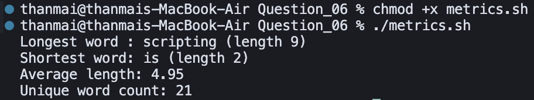

## Question 6 – Text Metrics

- **Script**: `metrics.sh`
- **Purpose**: Analyze `input.txt` to find the longest and shortest words, compute the average word length, and count unique words.

### How to Run

Make the script executable (one-time):

```bash
chmod +x metrics.sh
```

Run the script from inside the `Question_06` directory:

```bash
./metrics.sh
```

### Logic / Observation

The script uses `tr` to convert whitespace into newlines so each word appears on its own line, filters out empty lines, and then leverages `awk` to track total length, count, and min/max lengths.  
Finally, it calculates the average word length and uses `sort | uniq | wc` to determine how many distinct words appear in the input.

### Screenshot



### Output

```bash
chmod +x metrics.sh
./metrics.sh
```

```
Longest word : scripting (length 9)
Shortest word: is (length 2)
Average length: 4.95
Unique word count: 21
```

### Explanation

After making the script executable, `metrics.sh` reads `input.txt` and computes word statistics: the **longest word** is "scripting" (9 characters), the **shortest word** is "is" (2 characters), the **average word length** is 4.95, and there are **21 unique words**. These metrics show the script correctly tokenizing the text, tracking min/max and total length, and counting distinct words.
