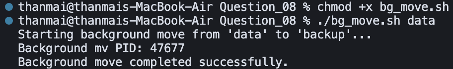

## Question 8 – Background Move with Job Control

- **Script**: `bg_move.sh`
- **Purpose**: Move files from a source directory into a `backup/` directory using a background job, printing the background PID and waiting for completion.

### How to Run

Make the script executable:

```bash
chmod +x bg_move.sh
```

Run the script with a source directory.Using the provided `data` directory:

```bash
./bg_move.sh data
```

After completion, the files from `data/` will be found under `backup/`.

### Logic / Observation

The script validates the source directory, creates a `backup/` folder if needed, and then starts an `mv` command in the background using `&`, capturing its PID from `$!`.  
It prints the background PID, then calls `wait` on that PID so the script can report when the move finished and with what status, demonstrating simple background job control.

### Screenshot



### Output

```bash
chmod +x bg_move.sh
./bg_move.sh data
```

```
Starting background move from 'data' to 'backup' ...
Background mv PID: 47677
Background move completed successfully.
```

### Explanation

The script is made executable and run with `data` as the source directory. It starts the move from `data` to `backup` in the **background**, prints the **background process ID** (e.g. 47677) so it can be monitored or killed if needed, then waits for that job to finish. The final line confirms the background move completed successfully, so files from `data/` are now under `backup/`. This demonstrates background job control with `&`, `$!`, and `wait`.


