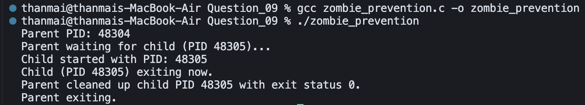

## Question 9 – Zombie Prevention (C, `fork()` + `waitpid()`)

- **Source**: `zombie_prevention.c`
- **Purpose**: Demonstrate proper child process cleanup using `waitpid()` so that no zombie processes remain.

### How to Compile and Run

From inside the `Question_09` directory, compile with `gcc`:

```bash
gcc zombie_prevention.c -o zombie_prevention
```

Then run the resulting binary:

```bash
./zombie_prevention
```

### Logic / Observation

The program calls `fork()`; the child sleeps briefly, prints messages, and exits, while the parent calls `waitpid()` on the child to collect its exit status.  
By explicitly waiting for the terminated child, the parent ensures the kernel can fully reclaim the child’s resources, preventing zombie processes and printing the PID of the cleaned-up child.

### Screenshot



### Output

```bash
gcc zombie_prevention.c -o zombie_prevention
./zombie_prevention
```

```
Parent PID: 48304
Parent waiting for child (PID 48305)...
Child started with PID: 48305
Child (PID 48305) exiting now.
Parent cleaned up child PID 48305 with exit status 0.
Parent exiting.
```

### Explanation

The program is compiled with `gcc` and then run. The **parent** (PID 48304) starts and announces it is waiting for its **child** (PID 48305). The child runs, prints that it is exiting, and terminates. The parent then **reaps** the child with `waitpid()`, prints the child’s PID and exit status (0), and exits. By collecting the child’s exit status, the parent allows the kernel to remove the child from the process table, so no **zombie** process is left. This demonstrates correct use of `fork()` and `waitpid()` for zombie prevention.


