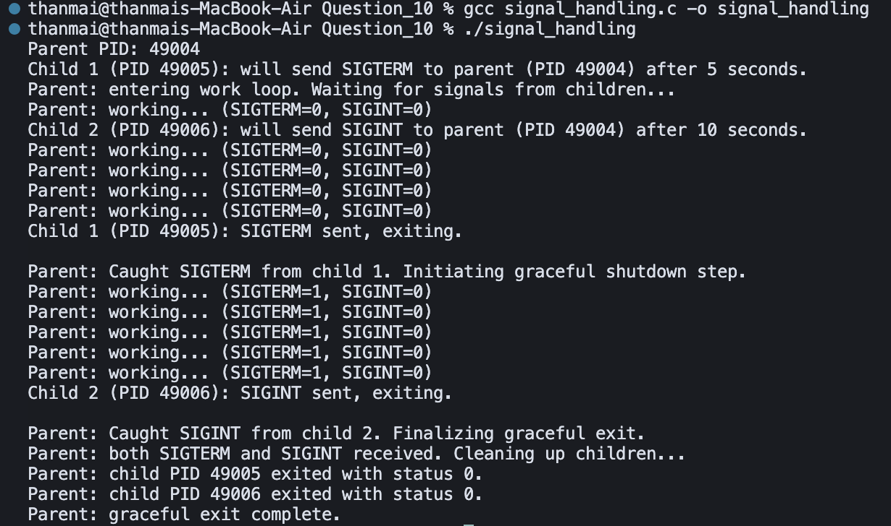

## Question 10 – Signal Handling with Multiple Children (C)

- **Source**: `signal_handling.c`
- **Purpose**: Demonstrate distinct handling of `SIGTERM` and `SIGINT` sent from two child processes to a looping parent, followed by a graceful shutdown.

### How to Compile and Run

From inside the `Question_10` directory, compile with `gcc`:

```bash
gcc signal_handling.c -o signal_handling
```

Then run the resulting binary:

```bash
./signal_handling
```

### Logic / Observation

The parent installs separate handlers for `SIGTERM` and `SIGINT`, then forks two children: child 1 sleeps 5 seconds and sends `SIGTERM`, while child 2 sleeps 10 seconds and sends `SIGINT`.  
The parent remains in a work loop, printing status until both signals have been received, prints distinct messages in each handler, then reaps both children with `waitpid()` and exits cleanly to demonstrate coordinated signal handling and graceful termination.

### Screenshot



### Output

```bash
gcc signal_handling.c -o signal_handling
./signal_handling
```

```
Parent PID: 49004
Child 1 (PID 49005): will send SIGTERM to parent (PID 49004) after 5 seconds.
Parent: entering work loop. Waiting for signals from children...
Parent: working... (SIGTERM=0, SIGINT=0)
...
Child 2 (PID 49006): will send SIGINT to parent (PID 49004) after 10 seconds.
Parent: working... (SIGTERM=0, SIGINT=0)
...

Child 1 (PID 49005): SIGTERM sent, exiting.
Parent: Caught SIGTERM from child 1. Initiating graceful shutdown step.
Parent: working... (SIGTERM=1, SIGINT=0)
...

Child 2 (PID 49006): SIGINT sent, exiting.
Parent: Caught SIGINT from child 2. Finalizing graceful exit.
Parent: both SIGTERM and SIGINT received. Cleaning up children...
Parent: child PID 49005 exited with status 0.
Parent: child PID 49006 exited with status 0.
Parent: graceful exit complete.
```

### Explanation

The program compiles and runs with one parent and two children. **Child 1** sends **SIGTERM** to the parent after 5 seconds; **Child 2** sends **SIGINT** after 10 seconds. The parent runs a work loop, printing status with two flags (**SIGTERM=0/1**, **SIGINT=0/1**). When it receives SIGTERM, it prints "Initiating graceful shutdown step" and sets SIGTERM=1; when it receives SIGINT, it prints "Finalizing graceful exit" and sets SIGINT=1. After **both** signals are received, the parent reaps both children with `waitpid()`, prints their exit statuses, and then "graceful exit complete." This shows coordinated handling of SIGTERM and SIGINT and a clean, signal-driven shutdown.

